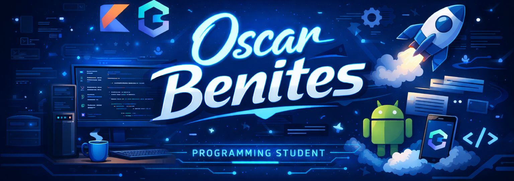

# ¡Hola! Soy Oscar Benites 👋 🇵🇪

  

### Operations Supervisor & Aspiring Software Developer

Soy un apasionado de la tecnología y la eficiencia operativa. Actualmente, me desempeño como Supervisor de Operaciones en la industria de Call Centers, mientras transiciono al mundo del desarrollo de software especializado en el ecosistema de **Kotlin**.

---

## 🚀 En qué estoy trabajando ahora

* 🛠️ **Current Project:** Nuestro Mapa de Sabores *(In-Dev)*
    * *App personal (pareja) para registrar reseñas, fotos y opiniones de restaurantes.*
    * **Stack:** Kotlin, Jetpack Compose, Local Data Persistence.
* 📚 **Learning:** Jetpack Compose & Clean Architecture.
    * *Enfoque en arquitectura MVVM para un desarrollo escalable.*

---

## 🛠 Mi Stack Tecnológico

### Lenguajes y Frameworks

### Gestión y Operaciones
**Operations Expert:** Team Leadership | NPS & Metrics Analysis (NPS, PECUF) | Process Improvement
**Soft Skills:** Communication | Conflict Resolution | Analytical Thinking

---

## 📈 Mi Camino de Aprendizaje (2026)

- [x] Fundamentos de Programación.
- [ ] Dominio de Jetpack Compose (En proceso 🏗️).
- [ ] Implementación de APIs con Ktor.
- [ ] Primera versión funcional de mi App de Restaurantes.

---

*"La consistencia le gana al talento el 100% de las veces."*
